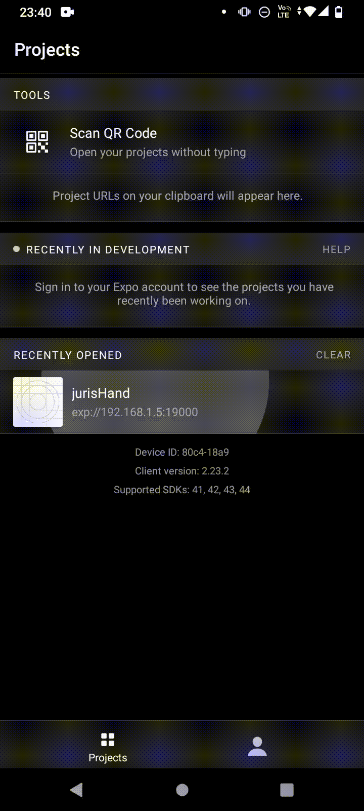

<h1 align="center">JurisHand</h1>

Esse projeto é uma aplicação que exibe um modal de assinatura.

 <a href="#features">Features</a> •
 <a href="#pré-requisitos">Pré Requisitos</a> •
 <a href="#tecnologias">Tecnologias</a> •
 <a href="#autor">Autor</a>

---

 

<h1 align="center">
  
</h1>

### Features

- [x] Modal
- [x] Butão de Assinatura

### Tecnologias

As seguintes ferramentas foram usadas na construção do projeto:

- [x] React Native + Expo CLI
- [x] Typescript
- [x] Lottie
- [x] Context
- [x] Css

### Pré-requisitos

Antes de executar, são necessários os seguintes softwares instalados na máquina:

 <ul> 
  <li> React Native</li>
  <li> Expo CLI ou Expo Go</li>
  <li> Android Studio</li>
  <li> Node</li>
 </ul>
 
 
Em em seguida abra no editor de sua preferência.

  
Após o clone, execute os seguintes comandos "npm install" e "npm start" na pasta "jurisHand"

   
### Autor

Desenvolvido por Gabriel Castro ! 🥇  
<kbd>
    
 </kbd>
